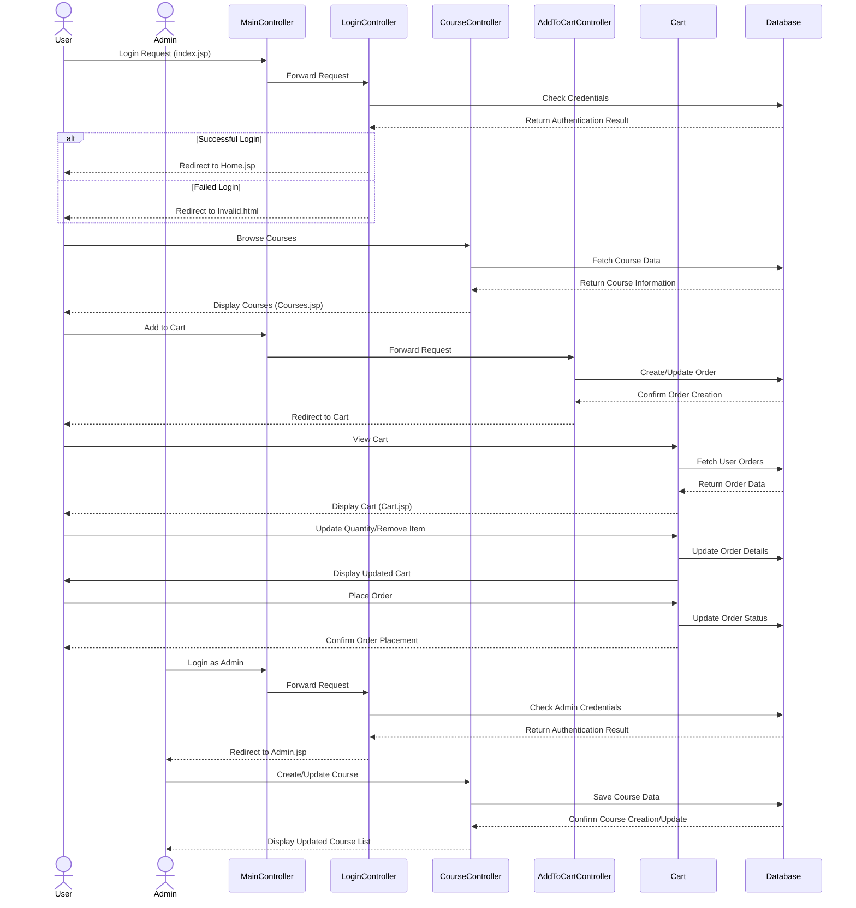

# TTK Piano Center - Music Course Management System

## Overview

TTK Piano Center is a web-based application designed to manage piano courses and facilitate the enrollment process. The system provides various functionalities for both administrators and users, allowing course management, user registration, shopping cart functionality, and order processing.

## Features

### User Features
- **User Authentication**: Register new accounts and log in securely
- **Course Browsing**: View all available piano courses with detailed information
- **Course Searching**: Search for courses by name or category
- **Shopping Cart**: Add courses to cart for later checkout
- **Order Management**: View and manage course enrollments

### Admin Features
- **Course Management**: Create, update, and manage course offerings
- **Category Management**: Organize courses into different categories
- **User Management**: View and manage registered users
- **Order Processing**: Track and process user enrollments

## Application Workflow

The following sequence diagram illustrates the core workflows in TTK Piano Center:

## Technologies Used

- **Backend**: Java Servlets, JSP
- **Frontend**: HTML, CSS, Bootstrap
- **Database**: SQL (accessed through JDBC)
- **Design Pattern**: MVC (Model-View-Controller)

## Project Structure

### Model Classes
- Course.java: Represents a piano course with details like name, description, tuition fee, etc.
- Category.java: Represents course categories
- Order.java and OrderDetail.java: Handle order information
- Registration.java: Manages user registration data

### Data Access Objects
- CoursesDAO.java: Database operations for courses
- CategoryDAO.java: Database operations for categories
- OrderDAO.java: Database operations for orders

### Controllers
- Course-related controllers:
  - CreateCourse.java: Handles creation of new courses
  - UpdateCourse.java: Manages course updates
- User-related controllers:
  - Authentication controllers
  - Registration controllers
- Cart-related controllers:
  - `AddToCartController`: Adds courses to user cart

### Views
- Login/Registration pages:
  - index.jsp: Login page
  - Register.html/Register.jsp: Registration pages
- Course management:
  - Courses.jsp: Display all courses
  - CreateNewCourse.jsp: Form for creating new courses
  - UpdateCourse.jsp: Form for updating courses
- User interface:
  - Home.jsp: Homepage
  - Cart.jsp: User shopping cart

## Installation and Setup

1. **Prerequisites**:
   - Java Development Kit (JDK)
   - Apache Tomcat server
   - MySQL Database
   - IDE (e.g., NetBeans, Eclipse)

2. **Database Setup**:
   - Create a database for the application
   - Import the database schema (if available)

3. **Configuration**:
   - Update database connection settings in `DBUtils.java`

4. **Deployment**:
   - Deploy the application to Tomcat server
   - Access the application through the browser

## Usage

### For Users
1. Register for a new account or login with existing credentials
2. Browse available piano courses
3. Add desired courses to cart
4. Proceed to checkout to complete enrollment

### For Administrators
1. Login with admin credentials
2. Access admin dashboard
3. Manage courses (create, update, delete)
4. View and process user enrollments

## Design Elements

The application features a clean and modern UI with:
- Responsive design using Bootstrap
- Custom CSS styling with gradient backgrounds
- Interactive buttons and form elements
- Social media integration options

## Security Features

- Password authentication
- Role-based access control (admin vs regular users)
- Form validation for user inputs

## Contributors

- TheKhiem7 (Original author)
- Admin (Contributor)